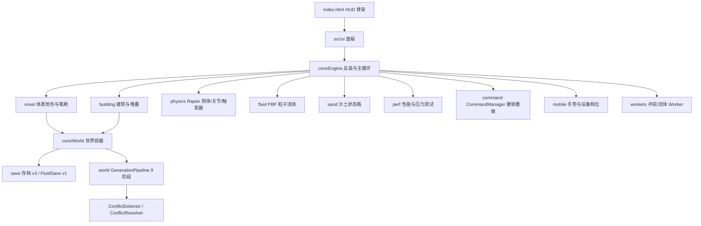

# 上帝沙盘模拟器 · God Sandbox

一个**纯前端**的低多边形体素沙盘：你以上帝视角雕刻地形、放置建筑、倾倒流体与沙土，并观察一套简化但自洽的物理在眼前发生。

> 没有后端、没有付费 API、没有联网多人。构建产物是纯静态文件，直接部署在 GitHub Pages 上。
> 刻意不追求照片级写实，也**不声称拟真现实** —— 目标是**可运行、可调试、可扩展**。

## 🎮 在线试玩

**<https://kono1357.github.io/gad-box/>**

打开就能玩，不需要注册、不需要安装。手机浏览器也能跑（会自动出触屏手势与降级策略）。
仓库：<https://github.com/Kono1357/gad-box>

---

## 特色

- **体素地形编辑**：5 种笔刷形状 × 12 种笔刷模式，半径 0.5~16、强度 0.1~1.0 支持小数，一次拖动 = 一步撤销。
- **394 个可放置模型**：从墙、地板、楼梯到冰箱、帆船、齿轮、传送门，全部由程序化基本几何体拼装，零外部模型文件。
- **真物理引擎**：接入 Rapier 3D（静态/动态/运动学刚体、6 种关节与马达、sensor 触发器 + 逻辑门、爆炸保护、位姿回溯）。物理是**异步加载**的，加载失败也照样能玩沙盘。
- **粒子流体**：PBF（位置法）求解器，5 种流体（水/油/蜂蜜/岩浆/牛奶）、6 个笔刷工具、冻结区做闸门、三种渲染风格、程序化音效。整池静止时**跳过整个求解**。
- **有状态的沙土**：每格记湿度与稳定性，安息角随湿度变化（干 34° / 湿 45° / 饱和 15°），支持沙崩连锁、水侵蚀成泥流、沙掩埋压塌建筑。
- **流体 ↔ 刚体双向耦合**：浮力、阻力、水流推动、迎面冲击、扶正力矩，三套预设（真实 / 游戏 / 夸张），每帧 2~3 次迭代收敛。
- **9 阶段程序化生成流水线**：高度图 → 水 → 沙 → 地表材质 → 自然物 → 建筑规划 → 建筑 → 小物品 → 冲突检测与修复，8 套地图模板 + 4 张参考地图。
- **内置验证体系**：`npm run verify` 跑 **2416 条中文断言**，分 20 个模块、**各自独立进程**，不需要浏览器。
- **10 个压力测试场景 + 负载热力图 + 帧录制**：桌面目标 30 FPS、移动端目标 15 FPS（需求给的硬指标）。
- **教学关卡**：3 关入门（门/小车/桥，10 步）+ 6 关物理（重力/摩擦/弹性/关节/浮力/倒塌，24 步）+ 6 关流体与沙土（**后者暂无 UI 入口**，见「未做的功能」）。

## 📷 截图

> **截图待补，而且这一批也没有补上**：这些图需要人用真机（或桌面浏览器）打开线上站点手动截。
> 本项目的开发环境里**没有浏览器、没有 WebGL**，所以我**生成不了**这些图，也**不会伪造**任何图片文件。
> 这一批里我请求过用**用户的手机**截屏（走设备侧的 `/app/ui/screenshot` 接口），**被用户拒绝**（原文：「你拒绝了这次截屏」），
> 用户明确选择「跳过，如实记录原因」。所以下面列出的是**约定好的截图位置**，补齐后把文件放到对应路径即可，
> 本文档的引用不需要再改。

| 文件 | 建议内容 |
| --- | --- |
| `docs/screenshots/01-overview.png` | 载入「平原村庄」模板后的整体俯瞰（左侧地形笔刷面板 + 右侧性能面板都在画面里） |
| `docs/screenshots/02-terrain-brush.png` | 用「抬升 + 球形」笔刷改地形的过程（笔刷线框光标可见） |
| `docs/screenshots/03-building-panel.png` | 物品面板：搜索框、最近使用、分类标签、长列表 |
| `docs/screenshots/04-fluid.png` | 泼水后的一池水（渲染风格切到「表面」） |
| `docs/screenshots/05-sand-collapse.png` | 沙崩可视化打开时的沙堆（稳定性着色 + 最陡方向线） |
| `docs/screenshots/06-physics.png` | 物理调试可视化：关节连线 / 触发器盒子 / 接触点 |
| `docs/screenshots/07-stress-report.png` | 压力测试面板跑完「10000 粒子水池」后的报告表 |
| `docs/screenshots/08-mobile.png` | 手机上竖屏的界面（顶部工具栏 + 折叠面板 + 虚拟摇杆） |

（`docs/screenshots/` 目录当前**不存在**，也**没有被创建** —— 没有图片就不该有一个空目录假装有。
这一批选择「跳过」的是**用户本人**，原因就是上面那句：本机没有浏览器、手机截屏的请求被拒绝。）

---

## 📚 文档索引

| 想看什么 | 去哪看 |
| --- | --- |
| 这个项目是什么、怎么跑起来、有哪些取舍 | 本文件（`README.md`） |
| 具体怎么操作（每个工具、每个面板、每个按键） | [`docs/USER_GUIDE.md`](docs/USER_GUIDE.md) |
| 想改代码：架构分层、数据模型、扩展指南、性能守则、测试体系 | [`docs/DEVELOPER.md`](docs/DEVELOPER.md) |
| 目标浏览器 / 现代 API 清单 / 已知风险表 / **真机自测清单** | [`docs/COMPATIBILITY.md`](docs/COMPATIBILITY.md) |
| 每个版本做了什么（含已知问题） | [`CHANGELOG.md`](CHANGELOG.md) |
| 怎么提 Issue / 提交前要跑什么 | [`CONTRIBUTING.md`](CONTRIBUTING.md) |
| CI 在跑什么 | `.github/workflows/deploy.yml`（typecheck + build + Pages）、`.github/workflows/verify.yml`（typecheck + 全量断言） |

⚠ 这里**没有 lint 文档**，因为项目**没有 lint**：`package.json` 里没有 ESLint / Prettier 相关的任何依赖，
仓库里也没有对应配置文件。不存在的步骤不写进清单。

---

## 快速开始

环境要求：**Node.js 20.19+ 或 22+**（推荐 22 LTS）、npm 10+、支持 WebGL2 的现代浏览器。

```bash
git clone https://github.com/Kono1357/gad-box.git
cd gad-box
npm install
npm run dev
```

⚠️ **开发服务器的访问地址带仓库名前缀**：<http://localhost:5173/gad-box/>

因为 `vite.config.ts` 配置了 GitHub Pages 需要的 `base`（默认仓库名常量 `DEFAULT_REPO = 'gad-box'`），开发服务器与预览服务器都遵循它。直接访问 `http://localhost:5173/` 会 404 —— 这是**预期行为**，它保证本地与线上路径行为完全一致，从根上消灭"本地能跑、线上白屏"。

> 注：`vite.config.ts` 里那段注释目前写的还是旧仓库名 `god-sandbox`，命令示例是过期的；
> **代码里的 `DEFAULT_REPO = 'gad-box'` 才是实际生效的值**，请以 `/gad-box/` 为准。

### 全部命令

```bash
npm run dev        # 开发服务器 → http://localhost:5173/gad-box/
npm run build      # 类型检查（tsc --noEmit）+ 生产构建 → dist/
npm run preview    # 静态预览 → http://localhost:4173/gad-box/
npm run typecheck  # 只做类型检查（strict 全开）
npm run verify     # 逻辑自测：2416 条断言，20 个模块各自独立进程，不需要浏览器
```

---

## 操作方式

### 顶部工具栏

从左到右分四组：**工具**（🖌 地形 `1` / 🏠 建筑 `2` / 🖱 选择 `3` / 💧 流体 `4` / 🏖 沙土 `5`）、
**场景与调试面板**（☰ 地图 `M` / ⌨ 快捷键 / 🎛 组合 `K` / 🎓 教学 `J` / ⚙️ 物理 `F2` / 🧪 沙盘模式）、
**编辑**（↶ 撤销 / ↷ 重做）、**文件与时间**（💾 保存 / 📂 读取 / ⬇ 导出 / ⬆ 导入 / ⏭ 单步 / ⏸ 暂停 / ⏪ 回溯 / 📸 快照）。

### 两种模式

`V` 键（或顶部「编辑 / 观察」按钮）在两种模式之间切换：

| | 编辑模式（默认） | 观察模式 |
| --- | --- | --- |
| 左键拖拽 | **地形**：涂抹笔刷　**建筑**：幽灵预览跟随 | 旋转视角 |
| 右键单击 | 擦除（地形）/ 删除光标下的建筑 | — |
| 右键拖拽 | 平移视角 | 平移视角 |
| 中键拖拽 | 旋转视角 | 旋转视角 |
| 滚轮 | 缩放（**Alt+滚轮**调半径，**Ctrl+滚轮**调强度；建筑工具下 Ctrl+滚轮调朝向） | 缩放 |

### 鼠标 / 触摸 / 快捷键概要

- **移动**：`W A S D` 或方向键；`Q` / `E` 降 / 升（建筑工具下 = 逆 / 顺时针旋转）；按住 `Shift` 加速（编辑时 `Shift` = 笔刷反向）。
- **笔刷**：`1~9 0 - =` 切换 12 种模式；`[` `]` 切换 5 种形状；`Alt+滚轮` 半径、`Ctrl+滚轮` 强度。
- **放置**：`Tab` / `Shift+Tab` 切换智能放置候选点；`Enter` 确认；`Esc` 取消；`G` 开关吸附点对齐。
- **选择**：左键点选、`Ctrl+左键` 加选、拖拽框选、`Ctrl+A` 全选、空格拿起/放下、`Delete` 删除、`Ctrl+D` 复制。
- **时间**：`P` 暂停/播放、`N` 单步 1/60 秒、`R` 回溯一帧（`Shift+R` 前进一帧）。
- **手机**：单指拖动 = 瞄准，单指轻点 = 放置/选择，单指长按 = 拿起，双击 = 取消放置，双指开合 = 缩放，双指拖动 = 旋转镜头。

> **完整快捷键表**在 `docs/USER_GUIDE.md` 第 13 节里，键位的**唯一真源**是 `src/ui/ShortcutPanel.ts` 的
> `DEFAULT_SHORTCUTS` 表（引擎只按它返回的动作 id 分发，见 `Engine.runShortcutAction()`）。
> （M5 之前有一张只读速查表 `src/ui/ShortcutHelp.ts`，它**已经被删除**，原因见文末的「文档与代码不一致的地方」。）

---

## 技术栈

| 层 | 选型 | 说明 |
| --- | --- | --- |
| 语言 | TypeScript 5.9 | `strict` + `noUnusedLocals` + `noUnusedParameters` + `noImplicitOverride` + `verbatimModuleSyntax` 全开 |
| 构建 | Vite 7 | `base` 按 `VITE_BASE` → `GITHUB_REPOSITORY` → `DEFAULT_REPO` 顺序解析 |
| 渲染 | Three.js 0.186 | 区块合并网格 + InstancedMesh + 程序化 `DataTexture` 图集 |
| 物理 | Rapier 3D (`@dimforge/rapier3d-compat` 0.21) | 动态 `import()`，wasm 内联在 4.3 MB 的 chunk 里 |
| 验证 | esbuild + Node | 把 TS 打成单文件在 Node 里跑断言，**不需要浏览器、不需要 WebGL** |
| 部署 | GitHub Actions → GitHub Pages | `npm ci` → `typecheck` → `build` → 上传 `dist/` |

### 架构一览与数据流

```
                          ┌──────────────────────────────────────┐
                          │   index.html（全部 HUD 的 DOM 骨架）  │
                          └───────────────┬──────────────────────┘
                                          │ 静态 id 契约（534 个唯一 id）
                    ┌─────────────────────▼─────────────────────┐
                    │            src/ui/*（30+ 个面板）          │
                    │  笔刷 / 物品 / 放置 / 选择 / 历史 / 流体    │
                    │  沙土 / 性能 / 压力测试 / 关节 / 逻辑连线   │
                    └─────────────────────┬─────────────────────┘
                                          │ 回调（面板不反向改世界）
┌─────────────────────────────────────────▼──────────────────────────────┐
│                      src/core/Engine.ts（总装 + 主循环）                │
│  每帧：输入 → 拾取 → 工具应用 → 物理子步 → 水/沙/流体模拟 → 分帧任务     │
│        → 区块网格重建 → UI 节流刷新 → 渲染提交（各阶段各自计时）         │
└───┬───────────┬───────────┬───────────┬───────────┬────────────────────┘
    │           │           │           │           │
    ▼           ▼           ▼           ▼           ▼
┌────────┐ ┌────────┐ ┌────────┐ ┌─────────┐ ┌──────────────┐
│ voxel/ │ │building│ │physics/│ │ fluid/  │ │  sand/  perf/ │
│体素地形│ │建筑实例│ │ Rapier │ │  PBF    │ │ 沙土   压力   │
│笔刷网格│ │支撑堆叠│ │ 关节   │ │ 空间哈希│ │ 安息角 热力图 │
└───┬────┘ └───┬────┘ └───┬────┘ └────┬────┘ └──────┬───────┘
    │          │          │           │             │
    └──────────┴────┬─────┴───────────┴─────────────┘
                    ▼
        ┌───────────────────────┐        ┌────────────────────────────┐
        │ core/World.ts 容器     │        │ command/CommandManager.ts  │
        │ （持有 VoxelGrid）      │◄──────►│ 体素 + 建筑统一撤销重做历史  │
        └───────────┬───────────┘        └────────────────────────────┘
                    ▼
        ┌───────────────────────┐        ┌────────────────────────────┐
        │ save/SaveSystem.ts    │        │ world/GenerationPipeline   │
        │ 存档 v3 + RLE + v1/v2 │        │ 9 阶段程序化生成            │
        │ save/FluidSave.ts v1  │        │ + ConflictDetector/Resolver│
        └───────────────────────┘        └────────────────────────────┘
```

Mermaid 版本（GitHub 上可直接渲染）：



---

## 开发与验证

### 测试体系一句话

`npm run verify` 用 **esbuild** 把每个检查入口打成单个 ESM 文件，再**各自起一个 Node 进程**跑断言。
**为什么每个模块一个进程**：这些模块各自要装假的 `document` / 假的 `localStorage`，合在一个进程里会互相污染
（曾经出现过"`preview` 的 DOM 断言因为别人留下的桩而失败""`customitem` 读到别人塞的 120 个自定义物品"），
失败信息读起来像是模块自己的 bug。进程退出时内核回收全局环境，谁也没法污染谁 —— 代价是启动几次 Node。

### 2416 条断言 · 逐模块

总数 **2416**，由 `scripts/checks/runAll.mjs` 的 **20 个条目**汇总而来
（14 个旧模块 1876 条 + M5 新增 6 个模块 540 条）。
下表数字来自**实跑**（用 `node .verify/<name>.mjs | tail -3` 读取每个模块自己打印的汇总行，
`.verify/` 是 `runAll.mjs` 用 esbuild 生成的打包产物）：

| # | 模块（`runAll.mjs` 里的名字） | 入口文件 | 断言数 |
| --- | --- | --- | --- |
| 1 | 内容统计热力图 | `scripts/checks/contentstats.run.ts` | 69 |
| 2 | 生成预览与模板面板 | `scripts/checks/preview.run.ts` | 61 |
| 3 | Worker 冲突检测 | `scripts/checks/worker.run.ts` | 47 |
| 4 | 自定义物品编辑器 | `scripts/checks/customitem.run.ts` | 75 |
| 5 | 流体核心（PBF / 空间哈希 / 粒子池） | `scripts/checks/fluid.run.ts` | 92 |
| 6 | 流体渲染与编辑工具 | `scripts/checks/fluid2.run.ts` | 38 |
| 7 | 沙土物理（安息角 / 沙崩 / 编辑） | `scripts/checks/sand.run.ts` | 59 |
| 8 | 流体-刚体耦合（浮力 / 阻力 / 冲击 / 力矩） | `scripts/checks/coupling.run.ts` | 46 |
| 9 | 沙水交互（变湿 / 侵蚀 / 沉积 / 压塌） | `scripts/checks/sandwater.run.ts` | 33 |
| 10 | 流体存档与教学关卡 | `scripts/checks/savetutorial.run.ts` | 50 |
| 11 | 压力测试场景与报告 | `scripts/checks/stress.run.ts` | 84 |
| 12 | 性能热力图与录制 | `scripts/checks/perfrec.run.ts` | 105 |
| 13 | 流体求解 Worker | `scripts/checks/fluidworker.run.ts` | 74 |
| 14 | 错误处理与安全模式（M5 第 1 批） | `scripts/checks/errors.run.ts` | 99 |
| 15 | 主题与交互面板（M5 第 2 批） | `scripts/checks/ui.run.ts` | 128 |
| 16 | 新手引导与帮助中心（M5 第 3+4 批） | `scripts/checks/onboarding.run.ts` | 152 |
| 17 | M5 引擎集成（M5 第 5 批） | `scripts/checks/integration.run.ts` | 65 |
| 18 | 兼容性静态审计（M5 第 5 批） | `scripts/checks/compat.run.ts` | 80 |
| 19 | 关节世界锚点（M5 收尾修 bug） | `scripts/checks/jointswap.run.ts` | 16 |
| 20 | 主验证（M1.5~M4） | `scripts/verify.ts` | 1043 |
| | **合计** | | **2416** |

> 上表全部 20 个模块**都已登记进 `runAll.mjs` 的 `ENTRIES`**（`errors.run.ts` 曾经漏登记过，M5 接线时补上了），
> `npm run verify` 一次跑完就是这 2416 条。逐条断言的覆盖面见 `docs/DEVELOPER.md` 第 5 节。

### 主验证（1043 条）覆盖什么

世界尺寸三档、程序化纹理的像素级检查（每种体素的贴图有没有图案、顶面是不是绿的）、
面剔除 / UV / 顶点 AO / 水面高度、笔刷 5 形状 × 12 模式、水的重力与容器、沙的安息角、
4 张参考地图与 8 套生成模板、394 个物品模型的 id 唯一与包围盒一致、
Rapier 自由落体 / 堆叠 / 暂停语义、地形 heightfield 高度一致性、智能放置候选与耗时、
选择框选、拿起放下还原、微调、分组 / 预制件 / 蓝图 / 镜像、撤销变换与历史回溯、
存档 v3（含 v2 / v1 兼容读取）、压力测试布局穿模、以及两轮的性能预算。

### 类型检查

```bash
npx tsc --noEmit    # 或 npm run typecheck
```

`vite.config.ts` 也在 `tsconfig.json` 的 `include` 里，所以构建配置本身也受类型检查保护。
M5 这一批跑出来的结果是 **0 报错**；`npm run build` **成功**，产物是
`dist/index.html` **74.79 kB** / CSS **18.54 kB** / JS **1912.22 kB** / `assets/rapier.js` **4336.69 kB**
（Vite 会对后面这个 4.3 MB 的 chunk 报一句 "chunks larger than 1500 kB" 的警告 —— 那是**已知且刻意**的，
wasm 内联在里面，见「技术栈」与 `vite.config.ts` 的注释）。

### 质量门禁（CI）与**没有 lint**

仓库里有**两个** GitHub Actions 工作流，分工不同：

| 工作流 | 触发 | 跑什么 | 为什么单独存在 |
| --- | --- | --- | --- |
| `.github/workflows/deploy.yml` | `push` 到 `main` / 手动 | `npm ci` → `npm run typecheck` → `npm run build` → 上传 `dist/` 到 Pages | 只管**能不能上线** |
| `.github/workflows/verify.yml` | `push` / `pull_request` | `npm run typecheck` + `npm run verify`（全量 2416 条断言） | 只管**逻辑有没有被改坏**，不碰 Pages |

分两个的理由：断言是"每次改动都必须过"的门禁，而部署只在 `main` 上发生 —— 混在一起会让
"PR 阶段就能发现的红"拖到合并之后才暴露。两者都跑 typecheck 不算浪费（几十秒，且各自独立可读）。

⚠ **本项目没有 ESLint、没有 Prettier**：`package.json` 里**没有**任何相关依赖，仓库里**也没有**任何
ESLint / Prettier 配置文件。所以这里**不会**写"提交前跑一遍 lint" —— 不把不存在的步骤写进清单。
代码风格靠 `tsconfig.json` 的 `strict` 全开 + 代码评审，以及那 2416 条断言。

---

## 部署（GitHub Actions 自动部署）

`.github/workflows/deploy.yml`：`push` 到 `main` 或手动 `workflow_dispatch` 时触发。

```
checkout → setup-node 22（npm 缓存）→ npm ci → npm run typecheck → npm run build
  → configure-pages → upload-pages-artifact(dist) → deploy-pages
```

- **为什么用 Actions 部署而不是提交 `dist/` 到 `gh-pages` 分支**：仓库里不需要存构建产物 —— rapier 那个 chunk 有 4.3 MB，改一行代码就重新提交一遍二进制会让仓库迅速膨胀。
- **`base` 由 `GITHUB_REPOSITORY` 自动推导**，所以**仓库改名不用改代码**。
- `concurrency.cancel-in-progress: true`：同一时间只跑一个部署，新推送取消旧构建，避免"旧构建覆盖新构建"。
- 首次部署需要在仓库 **Settings → Pages → Build and deployment → Source** 选 **GitHub Actions**。

### `base` 子路径与常见故障

| 现象 | 处理 |
| --- | --- |
| 白屏、404 `/assets/index-xxx.js` | `VITE_BASE=/仓库名/ npm run build` |
| Actions 报 `npm ci` 失败 | 提交 `package-lock.json` |
| Pages 404 | Settings → Pages → Source 没选 **GitHub Actions** |
| 手机卡顿 | 在性能面板切「性能优先」预设；确认世界档是新手档 |

构建产物里两个 Worker **单独成块**（`dist/assets/fluidWorker-*.js`、`dist/assets/conflictWorker-*.js`），
证明 `new Worker(new URL(...))` 的写法是静态可分析的、URL 被按 `base` 重写过。
`assets/rapier.js` 则被刻意设成**固定文件名**（`vite.config.ts` 的 `chunkFileNames`），
代价是它不再带内容 hash、要靠 HTTP 缓存头做验证，换来的是加载时能 `fetch()` 一次读到
`Content-Length` 并算出**真实字节进度**。

---

## 里程碑

| 里程碑 | 内容 | 状态 |
| --- | --- | --- |
| M0 | 工程初始化、Three.js 场景、轨道相机、FPS、Pages 部署 | ✅ |
| M1 | 体素地形显示与编辑、笔刷、局部重建、撤销重做、存档 | ✅ |
| M1.5 | 精细笔刷 / 程序化纹理 / 4 张参考地图 / 三档世界尺寸 / 水的重力 / 沙的安息角 / 77 个建筑 | ✅ |
| M2 | Rapier 接入 / 智能放置 / 堆叠支撑 / 拿起微调 / 选择分组 / 预制件蓝图镜像 / 历史面板 | ✅ |
| M2.5 | 叠罗汉堆叠重写 / 支撑面共享 / 换图真卸载 / 智能放置可视追踪 / 物理四层框架 / 20 组合 + 3 教学 / 移动端触屏 | ✅（2 项已知缺口，见取舍第 6 组） |
| M3 | Rapier 正式接入：世界生命周期 / 区块级地形碰撞体 / 碰撞分组 / 刚体工厂 / 材质运行时 / 关节与马达 / 时间倍速与位姿回溯 / 浮力 / 局部倒塌 / 应力可视化 / 触发器与逻辑门 / 调试可视化 / 距离剔除与分帧调度 / 压力场景 | ✅ 8 批 |
| M4（前半） | 物品库扩到 394 / 物品面板重写 / 9 阶段生成流水线 / 冲突检测与修复 / 生成日志 / 生成预览与回滚 / 冲突可视化 / 内容统计热力图 / 内容包 / 自定义物品 / 8 套地图模板 | ✅ |
| M4（后半） | 流体 PBF 求解器 / 沙土状态格 / 流体-刚体双向耦合 / 沙水交互 / 压力测试 10 场景 / 负载热力图 / 帧录制 / 流体存档 / 6 个流体教学关卡 / 求解 Worker | ✅ |
| M4.1 | 用户反馈第一轮优化：物品选择步骤、三处每帧开销、性能面板阶段拆分 | ✅ |
| M5 | 错误采集与安全模式 / 重置 / 损坏存档导出 / 主题切换 / 快捷键面板（可改键）/ 面板拖动折叠与位置记忆 / 新手引导 / 帮助中心 / 示例场景 / 教学目录（15 关统一登记 + 完成度）/ 兼容性静态审计 / 文档六件套 / CI 断言工作流 | ✅（缺口见下） |

> **M5 的接线状态（照实写，不夸大也不埋）**：
> `core/ErrorHandler.ts`、`core/SafeMode.ts`、`core/ResetManager.ts`、`core/CorruptSaveExport.ts`、
> `ui/PanelManager.ts`、`ui/ShortcutPanel.ts`、`ui/ThemeSwitch.ts`、`ui/HelpCenter.ts`、
> `tutorial/TutorialCatalog.ts` / `TutorialProgress.ts` / `Onboarding.ts` / `Examples.ts`
> **已经全部接进引擎**：`src/core/Engine.ts` 真的 `import` 并构造了它们，
> `index.html` 里有 `#error-panel`、`#help-panel`、`#tutorial-catalog-panel`、`#onboarding-tip`、
> `#theme-switch`、`#btn-help`，并且给 **21 个面板**加了 `data-panel`（其中 **6 个**带 `data-panel-no-collapse`）。
> 6 个新检查模块（`errors` / `ui` / `onboarding` / `integration` / `compat` / `jointswap`）**都已登记进
> `runAll.mjs` 的 `ENTRIES`**，`npm run verify` 现在是 **20 个模块 / 2416 条断言**（其中 **540 条**是 M5 新增的）。
> 其中 `integration.run.ts`（65 条）就是"接线断了就必须红"的那一层 —— 它专门断言这些模块确实被引用、确实有 DOM 节点。
>
> **M5 仍然没做完的部分（一条都不藏）**：
> - **Safari 16.0~16.3 仍会白屏**：three 的产物里有 **6 处** class static block，解析期就报 `SyntaxError`。
>   修法是一行 `build.target: 'safari16'`（实测确实能消掉那 6 处），但**没有 Safari 真机可验证**，所以没改。
> - **真机 / 多浏览器 / 弱网 / 触摸 / 无障碍测试全部没做**：容器里没有浏览器、没有 WebGL、没有真机，
>   也**没有截图**（原因见上文「📷 截图」）。
> - **`Ctrl+Shift+R`（重新生成地形）目前是死键**：绑定已从 `DEFAULT_SHORTCUTS` 里**删除**，
>   `Engine.regenerateTerrain()` 方法保留但**没有任何入口**（控制台除外）。
> - **`TutorialProgress` 的导出 / 导入没有 UI**：进度只存在 localStorage（`gad-box-tutorial-progress`）。
> - **浅色主题没覆盖帮助卡片与引导气泡**：`HelpCenter` 的卡片与 `Onboarding` 气泡仍是深色（`src/style.css` 未被 M5 改动）。
> - **安全模式的粒子上限靠"生成点建门 + 进入时裁剪"实现**：`FluidSystem.limit` 是只读的，改不了。
> - **Worker 内部抛出的异常不在错误采集范围内**（`ErrorHandler` 只听主线程的 `error` / `unhandledrejection`）。
> - **物理教学关不能跳关**：保留了解锁门（跳关接口里的"已完成数"授权检查没有被绕过）。
>
> 逐条清单与"为什么这么留"见 `docs/DEVELOPER.md` 第 8 节。

---

## 已知限制与取舍

下面按**主题**归类，合并了 M0~M5 各轮的取舍清单。每一条都是刻意的选择，不是"忘了做"。

### 物理近似

- **地形碰撞用 heightfield，碰撞面是线性插值**：方块地形在物理上表现为"缓坡"而不是台阶。好处是物体不会卡在方块棱角上，代价是贴地高度与体素表面最多差 ±1 米。
- **有洞穴 / 悬挑的区块退回 greedy 合并的 cuboid**（heightfield 会把空洞填实，表现是"看得见洞、走不进去"）；`MAX_BOXES_PER_CHUNK = 96` 是安全阀。
- **不做建筑破坏**：被砸到不会碎，只是被推开。
- **不做有限元式应力**：`StressVisualizer` 给的是 `0.55×(1−支撑充分度) + 0.30×承重比例 + 0.15×悬挑比例`，它能回答"我这座桥看起来合理吗"，**不能**回答"这根梁 3.2 秒后会不会断"。
- **支撑/堆叠判定是 AABB 数学 + 启发式阈值**，不是力学：`contactRatio` / `centerMargin` 的阈值是人为定的经验值。旋转物体用"旋转后的外接矩形"近似接触面积（偏向保守，只会更容易判成不稳）。真实倾倒交给 Rapier 动态刚体。
- **贴合判定刻意宽松（15 厘米容差）**：判太严会让玩家看到"明明挨着的两块砖上面那块却掉了"，那比偶尔把悬空砖算成稳的更像 bug。
- **浮力四条近似**：① 排水体积按 AABB 算 —— 空心船能浮靠的是"我们按盒子算"，不是"我们模拟了船体"；② 不做姿态力矩，**侧翻的木头不会自己翻回来**；③ 阻力是线性的 `-k·v`，快速入水没有真实减速感；④ 水面高度是由"淹了多深"反推的估计值。
- **关节**：6 种都走 Rapier 原生求解器。Rapier 0.21 **没有** `setMotorVelocity`（要用 `configureMotorVelocity` / `configureMotorPosition` + `setMotorMaxForce`）；`rope` / `spring` 都存在，不用自己施力。
- **触发器只给 begin/end**：`stay` 是我们自己按 200ms 节流补发的，面板上写明了。
- **物理 LOD 不是"远处换简单碰撞体"**（在 Rapier 里那是负优化），而是**参与度降级**：相机 24 米内完整模拟 → 静止 2 秒自然休眠 → 已休眠**且**离相机 60 米外才 `setEnabled(false)` 冻结。**冻结的代价必须写出来：它不再参与任何碰撞**，远处一块被冻结的石头，有东西飞过去砸它会直接穿过去。限制它的两条硬规则是"只冻结已休眠的物体"和"重要物体永不冻结"。
- **回溯只记位姿、不存世界快照**：写回位置 + 四元数并**清零速度**，300 帧缓冲 ≈ 7.7 MB。代价是**不重算接触力**，回溯后物理读数要等再跑一步才准。
- **倍速靠"每帧推进更多子步"而不是改时间步**：改步长会出现"同样一堵墙，1 倍速不倒、4 倍速倒了"。
- **拿起是 kinematic 而不是 dynamic**：拖动时自己不受力、能推开别人；移动中不做全量运动学同步。

### 流体近似

- **PBF 是位置法求解器**，不拟真：10000 粒子在 Node 单线程实测 **84.8 ms/帧（约 12 Hz）**，**没有达到"10000 粒子 60 FPS"**，差距约 5 倍。邻居收集与压力项是内存延迟主导（46.8 个候选/粒子、每次散读约 63 ns），要再快一个量级需要"按空间哈希重排粒子数组"或把求解搬进 Worker。
- **刚体 → 流体只有"静止边界"**：流体求解器把建筑包围盒当固体，所以水会绕开箱子；但**运动中的刚体不会带动水（没有尾流）** —— 那需要把刚体速度作为 PBF 的边界条件传进去，**没做**。
- **耦合的"双向"指**：流体 → 刚体有浮力、阻力、推动、冲击、力矩；刚体 → 流体只有阻挡。
- **每帧 2~3 次迭代是"把力分次施加"**，不是把求解器跑三遍；迭代次数是预设参数（真实 3 / 游戏 2 / 夸张 2），不是物理常数。
- **安全阀**：每个物体每帧的合力 / 力矩都有上限，被夹住的次数**如实统计**（面板显示"⚠ N 个被力上限夹住"）。夹得多了说明参数不合理，而不是"物理就是这样"。
- **体素 ↔ 粒子换算不守恒**：1 m³ 按静止间距应是 244 个粒子，但那样"冲掉一格"就瞬间多出 244 个粒子；这里用**观感换算 1 格 → 6 个粒子**。代价是浑水看起来比实际偏淡。
- **整池静止跳过是"整池"**，不是"逐粒子休眠"：大部分静止、少数在动的水池不会被跳过。
- **冻结区是按坐标判断的**（不是按粒子下标 —— 下标会变、坐标不会）。
- **渲染风格三选一**：粒子 / 表面（密度场重建连续液面）/ 混合。表面重建有分辨率上限，分辨率之外的水花只靠粒子点缀。
- **流体音效是 Web Audio 现场合成的**，零音频素材；浏览器要求用户手势之后才能出声，所以面板上写着"点击后才会出声"。

### 沙土近似

- **安息角是离散近似**：真正的落沙规则只能产生 45° 堆角，本实现用 `slideDistance = 1/tan(角度)` 决定"滑动前瞻距离"，34° → 1.48 格 → 在"前瞻 1 格（45°）"和"前瞻 2 格（约 26°）"之间按概率混合。长期统计平均坡度接近设定值，**但它是两档之间的概率混合，不是连续的精确角度控制**。
- **三个锚点精确命中，中间是分段线性插值**（诚实起见不编曲线）：干沙 34° / 湿沙 45° / 饱和沙 15°。实测堆出来的坡度是 31.6° / 45° / 11.3°，与目标差 2~4°（离散格子的固有误差），所以断言钉的是"两者分得开、且落在合理区间"。
- **沙崩阈值是 12 格**（一次搬动 ≥12 格记为一次沙崩）：定太高会漏、定太低会刷屏。
- **沙水交互三处取舍**：① 侵蚀是**概率化**的（确定性阈值会让河床一瞬间被削平，看起来像 bug）；② `dt` 被夹在 0.1 秒（卡帧之后一帧把整片沙浇透会很难看）；③ **压塌是启发式** —— 只看建筑顶上的沙格数（默认阈值 18），不区分承重结构、不算力矩。它保证"沙压得够多就会塌"，**不保证"塌在正确的格子上"**。
- **沙的元数据按世界尺寸一次性分配**：湿度与稳定性各一个 `Uint8Array`，大档 192×32×192 各 1.18 MB、合计 2.4 MB。只在换世界时重建。
- **凝固不可逆**（把沙变成石头），所以这个工具的节流最长（300 ms），不该被误触连点。

### 性能与渲染

- **水的渲染代价**：为了让水面真的有透明感，水和玻璃走独立的半透明几何体，所以**含水的区块是 2 次 draw call**（不含水的仍是 1 次）。
- **地形不用 InstancedMesh**：体素地形更适合**区块合并网格**（一个区块一次 draw call + 面剔除后三角形数大幅下降），**建筑**才用 InstancedMesh。各自用在对的地方。
- **不做 LOD，不做遮挡剔除**（需求里标了"可选"，资源投给了距离剔除与分帧调度）。
- **没有阴影贴图**：仍然用"面朝向明暗 + 顶点级 AO"出体积感，手机上更省。
- **不做 Service Worker**：子路径部署下 SW 的 scope 与"改了代码缓存没更新"是经典坑；改为"资源按需分包 + 物品库懒加载"。
- **自适应降级"降级容易、恢复难"**：降级需连续 1 秒低帧率，恢复需连续 6 秒高帧率 + 5 FPS 余量。这是刻意的迟滞，否则画质会随帧率抖动反复横跳，而每次改渲染距离都要卸载/重建区块，反而更卡。
- **"抗锯齿"是上下文创建参数，运行时无法真正切换**：质量预设里的 `antialias` 语义是"是否允许超采样"，用 `devicePixelRatio`（关时压到 1）表达，不重建渲染上下文。
- **AO 是烘焙进顶点色的**，切换它需要重建全部区块网格。
- **热力图不是每帧实际耗时**（说三遍）：WebGL 没有"按屏幕区域计时"的接口，图上数字**永远是加权物件数**（流体/沙/地形/其它 = 1 是单位口径，刚体 = 4 是**估计值**）。canvas 左下角的角标把这句话**画进位图**，截图传播也带着。
- **1000 箱子堆叠永远跑不到 1000**：桌面动态刚体上限 800（移动端 300），摘要里会显示"请求 1000 → 800"。
- **帧录制环形缓冲 3600 帧（60 秒）**，满了覆盖最旧的并**如实报告丢了多少帧**。
- **`Path` 上的失败优化记录**：`cellsWithin` 里加一次 `subarray().sort()` 让整体从 47 ms 涨到 138 ms（每粒子每帧一次排序）。代码里留了注释，别"顺手优化"回来。

### 未做的功能

- **（M5 起已接线，这里记一次修正）6 个流体与沙土教学关卡现在能从界面进入了**：`src/tutorial/FluidSandTutorial.ts`
  的六关（水流向低处 / 浮力与船 / 水压与闸门 / 沙崩 / 泥流 / 洪水）以前**没有 UI 入口** ——
  `index.html` 里没有对应面板、`setFluidTutorialActive()` 全仓库没有任何调用点。M5 的第 3+4 批补上了
  「🎓 关卡目录」面板（`#tutorial-catalog-panel`）：**15 关统一列在一个面板里**，点「流体 / 沙土」分类下某一关的
  「开始」就会 `startTutorialLevel(id)` → 重置该关并激活运行器，面板下方的状态行会显示当前关与"还差什么"，
  旁边还有「下一关 / 重开本关 / 退出教学」。旧文案（"缺的只有那块 UI"）在这一批已经过期，故改写为现状。
- **存档里不含关节 / 触发器 / 逻辑连线**。存档存的是建筑**实例 id**，而关节两端在 Rapier 里是**刚体 handle**，读档时刚体会全部重建、handle 全变，所以要先做"id ↔ handle"双向映射与重连 —— 这是一个独立课题，仓促做只会做出"读档后关节连到随机物体上"的更糟结果。**但绝不静默丢数据**：保存时如果世界里有关节/触发器/连线，会明确弹提示告诉玩家读档后要重新摆。
- **没有物理调试可视化扩展到"接触点与受力箭头"的完整版**：`PhysicsDebug.ts` 只画方向 + 相对长度，并且**如实命名为"接触法线箭头"而不是"受力箭头"**（Rapier 的 JS 绑定没暴露每个接触点的冲量，要拿真实的力必须开 `CONTACT_FORCE_EVENTS`，而那给的是整对碰撞体的合力）。
- **非门仍然不可用拖拽配置**：它需要"抑制源"这个第二参照物，拖拽只能表达两个端点。面板上写明了原因并给替代方案。
- **冲突检测的 Worker 版本没有接进流水线阶段 9**：实测"光打包地形快照就不比检测本身便宜"（新手档 1.6~2.7 ms 打包 vs 1.8~3.4 ms 检测；大档 30~40 ms 打包 vs 17.7~20.5 ms 检测，净亏 10~20 ms）。`ConflictRunner` 保留为"结果与同步路径逐字一致"的可用能力，等快照搬运量降下来再接。
- **生成预览是降采样近似**：画布右下角标着"近似预览 · 非真实体素"，`PreviewData.limitations` 列了至少 5 条（小物品与门洞的冲突看不出来、洞穴/悬垂处不准、不跑物理、只跑了阶段 1~4 + 规划与撒点、冲突修复还可能再删树）。
- **生成回滚只回滚"参数 + 种子"**，不保留体素副本（大世界档保留两份 `Uint8Array` 会吃上百 MB）。
- **玩家自定义物品不能上传模型、不能自定义碰撞体形状、不能加新的物理组件类型** —— 纯前端没有模型解析器与付费存储；组件类型是代码里的枚举。自定义范围是"用基本几何体拼一个东西"。
- **物品库的 77 个 M1.5 老物品没有搬进 `catalogs/`**：搬迁是纯机械操作但影响面很大（存档、组合、教学关、断言都按 id 引用），而本项目的验证手段只有 `tsc` + 断言 + DOM 静态核对，**没有浏览器可以肉眼确认渲染结果**。所以对外仍然只有 `BUILDING_CATALOG` / `getBuildingDef()` 一个入口，数据源是唯一的，只是文件分在两个目录里。
- **旧存档的尺寸不匹配时不做自动转换**：载入时按存档里的尺寸重建世界（老存档仍能打开，只是世界回到存档记录的那个档位）。**没有实现把体素从一个尺寸重采样到另一个尺寸**。
- **撤销历史不包含水 / 沙的模拟结果**：模拟改动不计入 `CommandManager`，否则撤销会和水流互相打架。撤销只回退"玩家亲手做的编辑"。
- **体素类型上限 256 种**（`Uint8Array` 存 id，当前 19 种）；新增**只能在数组末尾追加**，否则会破坏已存档的世界。
- **`PhysicsWorld` 只应该有一个活跃的 `TerrainCollider`**：产品里地形是单例所以没问题；同时挂多个地形需要自己先 `dispose()`。
- **唯一未完成的验收项：浏览器端实机验证。** 开发环境里没有浏览器（也无法截屏：本机没有浏览器，
  用手机截屏的请求又被用户拒绝，见「📷 截图」），所以全部 UI 与渲染效果只经过了 `tsc`（0 报错）+ 2416 条断言
  + DOM id 静态核对 + jsdom 冒烟，**没有真跑过浏览器**。任何"看起来应该没问题"的渲染代码都需要人实际打开页面确认一次。

---

## 常见问题（FAQ）

**1. `npm run dev` 之后打开 `http://localhost:5173/` 是 404？**
这不是坏了。`base` 被设成了仓库名，所以地址是 <http://localhost:5173/gad-box/>。这样本地和线上路径行为一致。

**2. 线上页面白屏 / 控制台报 404 `/assets/...`？**
大概率是 `base` 不对。<kbd>VITE_BASE=/你的仓库名/ npm run build</kbd> 重新构建。CI 环境下它会自动读 `GITHUB_REPOSITORY`，所以仓库改名不用改代码。

**3. 为什么物理要"加载一下"才生效？**
Rapier 的 wasm 内联在一个 4.3 MB 的 chunk 里。静态引入会把首屏拖到 5 MB，所以改成 `await import()`：主包先渲染地形，物理块后台加载，加载完成后再接管。**加载失败不等于启动失败** —— 会明确告诉玩家"沙盘仍可使用，但没有重力与碰撞"，而不是白屏。

**4. 为什么我挖掉地形之后，上面的东西不会马上掉？**
失去支撑后有一个**600 毫秒宽限期**（先提示"有 N 个物体失去支撑，马上会掉"），然后只有**跟地基断开的那一块**才转成动态刚体 —— 这是"局部倒塌"，避免挖掉塔底一块砖导致旁边没关系的全塌。

**5. 水为什么摊得很薄？一格水为什么铺满一个大盆？**
这是元胞自动机的正常表现，不是 bug：没有最小厚度概念、没有压力与表面张力，一格最多装 1.0，超过的部分靠分给邻居消化。

**6. 我调了湿度，为什么干沙和饱和沙堆出来的坡度还是差不多？**
安息角是**两档之间的概率混合**，不是连续角度控制（见上文"沙土近似"）。实测 31.6° / 45° / 11.3°，能分得开，但不会精确等于 34.0°。

**7. 我把 1000 个箱子堆起来，为什么只有 800 个？**
桌面动态刚体上限就是 800（移动端 300），超过的部分会**退化成静态并记账**，不静默降级。摘要里会显示"请求 1000 → 800"。

**8. 洪水场景为什么冲不倒建筑？**
20000 粒子的上限等于 **81.9 m³ 水**；把 20×20 街区淹到 0.5 米需要约 48828 个粒子（上限的 2.45 倍）。所以那个场景只能做"街道浅水"。

**9. 性能面板说"渲染"是瓶颈，我该优化渲染吗？**
先看阶段拆分。以前"渲染"是**残差**（扣掉物理与模拟之后的一切），于是区块重建、支撑面、UI 面板全被算进"渲染"，会把人引到错误方向。现在分成 `物理求解 / 水沙模拟 / 区块重建 / 支撑面索引 / 视锥剔除 / UI 面板 / 交互拾取 / 渲染提交`，**各段各自计时**，渲染才是残差。慢帧记录里会给出"最慢阶段"。

**10. 载入存档之后我接的关节都不见了？**
见"未做的功能"第一条。保存时有关节/触发器/连线的话会有明确提示，读档后需要重新摆。

**11. 手机上很卡怎么办？**
点右侧性能面板的「性能优先」预设；关掉「地形线框」与「区块边界」；确认世界档是新手（48×16×48 / 9 区块）。低端设备会自己降级，但降级是迟滞的（恢复比降级难得多）。

**12. 我改的代码为什么没生效？**
`npm run dev` 有热更新；如果是改了 `index.html` 的 DOM 结构或 `src/style.css`，刷新一次。改动 client 相关代码后如果没反应，重启 dev 服务器。

---

## 目录结构

```
gad-box/
├── index.html                     全部 HUD 的 DOM 骨架（UI 与它按 id 契约绑定；21 个面板带 data-panel）
├── vite.config.ts                 base 子路径解析 + rapier chunk 固定文件名
├── tsconfig.json                  strict 全开
├── .github/workflows/deploy.yml   Pages 自动部署（typecheck → build → deploy）
├── .github/workflows/verify.yml   CI 断言（typecheck + 全量 2416 条，push / PR）
├── docs/
│   ├── USER_GUIDE.md              玩家使用说明（每个工具的具体操作步骤）
│   ├── DEVELOPER.md               开发者文档（架构 / 数据模型 / 扩展指南 / 性能守则）
│   ├── COMPATIBILITY.md           兼容性静态审计（目标浏览器 / 现代 API 清单 / 风险表 / 真机自测清单）
│   ├── screenshots/               ⚠ 待补：截图需要人用真机截，目录当前不存在也没被创建
│   └── snippets/                  6 个早期设计片段（HTML 原型，只读）
├── scripts/
│   ├── verify.ts                  主验证脚本（1043 条断言）
│   └── checks/                    19 个专题检查模块 + runAll.mjs（每个模块一个进程）
└── src/
    ├── main.ts                    入口
    ├── config.ts                  世界/渲染/相机/笔刷/水/沙/支撑/剔除/存档/流体常量
    ├── appState.ts                跨模块共享状态（避免 UI ↔ Engine 循环依赖）
    ├── worldSize.ts               三档世界尺寸预设
    ├── core/                      Engine（总装与主循环）/ Time / World / QualityPreset / random
    │                              ErrorHandler、SafeMode、ResetManager、CorruptSaveExport（M5，已接线）
    ├── voxel/                     Chunk / VoxelGrid / ChunkMesher / VoxelMaterials（程序化图集）
    │                              TerrainGenerator / BrushSystem / BrushVisualizer / ChunkCulling / VoxelRaycast
    ├── data/                      voxelTypes（19 种体素）/ buildingCatalog（394 个物品的聚合入口）
    │                              buildings/ + catalogs/（13 个数据文件）/ maps（4 张参考地图）
    │                              mapTemplates（8 套生成模板）/ combos（20 个物理组合）
    │                              physicsMaterials / gravityPresets / jointTypes / stressTestMaps / contentPacks
    ├── building/                  BuildingSystem / BuildingRenderer / BuildingPreview / StackingSystem
    │                              SupportSurface / types
    ├── physics/                   RapierWorld / PhysicsWorld / TerrainCollider / ColliderFactory
    │                              RigidBodyFactory / PhysicsMaterial / PhysicsFramework / JointFactory
    │                              JointSystem / TriggerSystem / LogicLink / ComboBuilder / TimeControl
    │                              BuoyancySystem / CollapseSystem / StressVisualizer / DragSystem
    │                              FluidRigidCoupling / PhysicsDebug / PhysicsGuard / PhysicsRecorder
    │                              PhysicsAudio / DistanceCulling / FrameScheduler / PhysicsSnapshot
    │                              WaterSystem / SandSystem（旧版落沙） / SupportSystem / StackSystem
    ├── fluid/                     FluidSystem / PBFSolver / ParticlePool / SpatialHash / FluidSurface
    │                              FluidRenderer / FluidEditor / FluidPresets / FluidAudio / ParticleFluidField
    ├── sand/                      SandSystem / SandPhysics / SandEditor / SandVisualizer / SandWaterInteraction
    ├── placement/                 SmartPlacement / SnapPoints / HighlightRenderer / CameraTracker / ScreenEdgeArrow
    ├── selection/                 SelectionSystem（高亮合批）/ PickupSystem（拿起 / 微调）
    ├── group/                     GroupSystem / PrefabSystem（等轴测 SVG 缩略图）/ BlueprintSystem
    ├── world/                     GenerationPipeline（9 阶段）/ MapGenerators / MapPlanner / ObjectPlacer
    │                              BuildingPlanner / ConflictDetector / ConflictResolver / ConflictRunner
    │                              ConflictOverlay / GenerationContent / GenerationLogger / GenerationPreview
    │                              WorldLoader / WorldUnloader / ResourceMonitor / AdaptiveQuality
    │                              StressTestGenerator / FluidWorkerRunner
    ├── workers/                   fluidWorker / fluidWorkerCore / fluidWorkerTypes
    │                              conflictWorker / conflictWorkerCore / workerTypes
    ├── perf/                      PerformanceMonitor / FrameProfiler / SlowFrameLogger / AutoDegrade
    │                              MemoryPanel / PerfHeatmap / PerfRecorder / StressTestReport / StressTestScenes
    ├── render/                    RenderSystem / GodCameraControls
    ├── input/                     InputSystem（鼠标 / 触摸 / 键盘 / 滚轮）
    ├── mobile/                    MobileController / TouchInput / VirtualJoystick / DeviceCapability
    │                              HapticFeedback / Orientation / GestureTutorial
    ├── tutorial/                  TutorialLevel（3 关 10 步）/ PhysicsTutorial（6 关 24 步）
    │                              FluidSandTutorial（6 关）/ TutorialCatalog（15 关统一登记）
    │                              TutorialProgress（完成度）/ Onboarding（7 步引导）/ Examples（12 个示例）
    ├── save/                      SaveSystem（v3 + RLE + v1/v2 兼容）/ FluidSave（v1，量化 + 打包）
    ├── command/CommandManager.ts  体素 + 建筑统一撤销重做
    └── ui/                        38 个模块（物品 / 笔刷 / 放置 / 选择 / 历史 / 流体 / 沙土 / 性能 …）
                                   含 M5 的 ThemeSwitch / ShortcutPanel / PanelManager / HelpCenter
```

> 说明：`src/**` 现有 **205 个 `.ts` 文件**、`scripts/**` 有 **39 个 `.ts`**、`src/ui/` 有 **38 个 `.ts`**
> （这三个数是 `find`/`ls` 数出来的）。`src/ui/ShortcutHelp.ts` **已被删除**，所以它**不在**上面的树里
> —— 原因见下一节。

---

## 文档与代码不一致的地方（已知，逐条列出）

写文档时做了一次静态核对（读文件比对，不是猜），下面这些地方**代码是准的、旧文案是过时的**。
除了第一行那条已随文件一起删除，其余几条都还在**不属于文档的代码文件里**（`vite.config.ts` / `index.html` /
`package.json` / `src/**`），所以在这里登记，方便以后顺手清掉：

| 位置 | 写着什么 | 实际是什么 |
| --- | --- | --- |
| `vite.config.ts` 顶部注释（约 20 行） | 本地访问 `/god-sandbox/` | `DEFAULT_REPO = 'gad-box'` → 实际是 `/gad-box/` |
| `index.html` 第 11 行 `<title>`、第 22 行顶部标签、第 1254 行主菜单标题 | `M1.5` / `God Sandbox M1.5` | 已经到 M5 了 |
| `package.json` 的 `description` | "M2：智能放置 / 堆叠 / 拿起 / 分组 / 预制件 / 蓝图" | 已经到 M5 了 |
| `src/save/SaveSystem.ts` 类注释（约 195 行） | "存档系统（v2）" | `SAVE_CONFIG.version = 3`（v3） |
| `src/data/maps.ts` 新手岛 `description` | "64×24×64 的小岛" | 新手档是 **48×16×48**（`src/worldSize.ts`） |
| `src/ui/ShortcutHelp.ts`（**该文件已被删除**） | 一张只读的快捷键速查表，其中 **3 处键位是错的**（`Tab` / `R` / `Ctrl+E`，见下），还**漏了 5 个已绑定的键**（`K` / `J` / `F2` / `V` / `Shift+B`） | M5 起由 `src/ui/ShortcutPanel.ts` 接管（可改键的活面板），它**不再被任何代码引用** —— 留着一张没人用又写错的表，下一个人迟早照它抄。所以**文件已 `rm` 删除**（`npx tsc --noEmit` 仍然 0 报错）。上面那 3 处错误键位与 5 个漏项随文件一起消失；**键位表现在只有一个真源：`ShortcutPanel.DEFAULT_SHORTCUTS`** |
| `docs/` | 早期只有 `snippets/`（两个 HTML 原型） | 现在有 `USER_GUIDE.md` / `DEVELOPER.md` / `COMPATIBILITY.md` 三份正文 + `snippets/` **6 个**片段（`ls docs/snippets` 数出来的） |

完整的快捷键口径以 [`docs/USER_GUIDE.md`](docs/USER_GUIDE.md) 第 13 节为准，
而那一节又是从 `src/ui/ShortcutPanel.ts` 的 `DEFAULT_SHORTCUTS`（表）+ `src/core/Engine.ts` 的
`runShortcutAction()`（分发）逐条核对出来的 —— 代码是唯一真源，表里没有的键就是没有绑定。

---

## 许可证与免责声明

本项目以 **MIT 许可证**发布，版权行为 `Copyright (c) 2026 gad box`，详见 [LICENSE](LICENSE)。

**免责声明**：

- 这是一个**模拟器**，不是物理引擎的教学材料。文中标注的近似（离散安息角、AABB 排水体积、线性阻力、启发式应力）
  都**不能**用于任何工程、结构或流体力学判断。
- 项目是纯前端静态站点，**没有后端、没有账号、没有数据上报**。你的存档只存在自己浏览器的 localStorage 里，
  清浏览器数据就会丢 —— 重要作品请用「导出 JSON」存成文件。
- 第三方依赖（Three.js、Rapier）各自遵循其自身许可证。
- "上帝沙盘模拟器"是一个玩具，不承诺任何可用性、正确性或性能指标。
